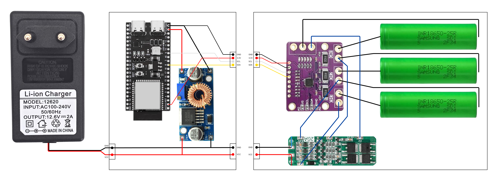
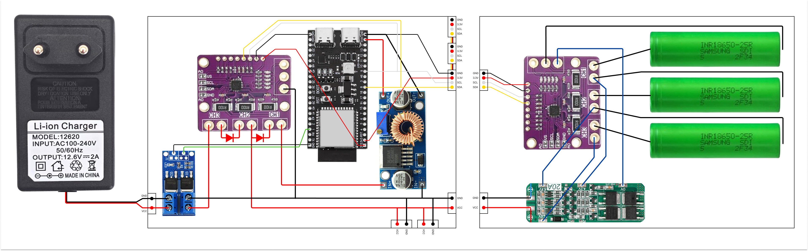
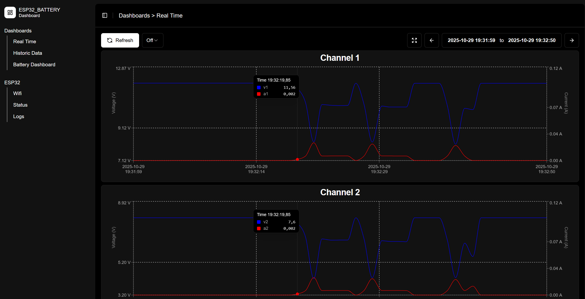
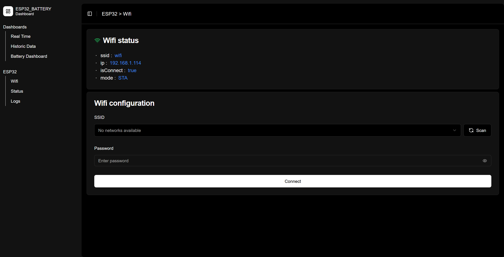

# Batmonitor: 3S Battery Monitor with ESP32 + INA3221 + MicroPython


## 🚀 Install
1. **Clone the project**
2. **Install MicroPython firmware** on ESP32
3. Copy **./www** and **./srv/*** to ESP32
    - Copy the entire **./www** folder to the **root** of the ESP32.
    - Copy all files from **./srv/** to the **root** of the ESP32.
4. **Edit .env** file on the ESP32 (check .env.example)
5. **Reset ESP32**
6. [Open Webapp](#accessing-the-interface)

## 🎯 Project Goals
- **Monitor the health** of each cell in a 3S battery
- **Analyze the behavior** of a smart charger (current, voltage, balance)
- **Understand imbalances** between cells
- Provide a **modern web interface** for visualization and export
- Eventually send alerts if a cell is defective or too worn


## ⚡Features
| Feature | Description |
|----------------|-------------|
| **Continuous measurement** | Voltage of each cell (**V1, V2, V3**) + global current via **INA3221**<br>(Configurable frequency from **1 Hz to 10 Hz**) |
| **Data history** | Storage in `DataHist` with **aggregation** (average, Wh, ...) |
| **Access Point mode** | On **first boot** or **no Wi-Fi configured**, the ESP32 creates an access point:<br>` -SSID: ESP32_Access_Point`<br>` -Password: 12345678`<br>Access the interface via **`http://192.168.4.1`** |
| **Built-in web server** | Modern user interface + **HTTP API** |
| **CSV export** | download of historical data |

## 🛠 Required Hardware
- **Microcontroller**: ESP32 (DevKit, NodeMCU, etc.) – the more memory the better.
- **Current/voltage sensor**: INA3221 (3 channels)
- **Battery**: 3S BMS + 3×18650
- **5V power supply** for the ESP32
- **Battery charger** (various chargers to test)

## 📐 Electrical Schematics
### **Version v0** – Battery monitoring only


- Measurement of **cell voltages** (V1, V2, V3)

| Measurement | Formula | Description |
|--------|---------|-------------|
| **V1** | `V1 = CH1.v` | Voltage of the first cell |
| **V2** | `V2 = CH2.v - CH1.v` | Voltage of the second cell |
| **V3** | `V3 = CH3.v - CH2.v` | Voltage of the third cell |

- **Global current** measurement via INA3221 shunt

| Measurement | Formula | Description |
|--------|---------|-------------|
| **Global current** | `I = (CH1.a + CH2.a + CH3.a)/3` | Average of the 3 channels |


---
### **Version v1** – Full monitoring (battery + charger + ESP32)


- V0 measurements (V1, V2, V3, I)
- Charger **isolation via MOSFET** possible
- Added measurements:
  - **Charger voltage & current**
  - **ESP32 consumption**

- Ideal for **diagnosing a smart charger**


## 🌐 Web Interface (`./www`)


Web application built with **React** and **shadcn/ui** in a separate project: [`batmonitor-webapp`](https://github.com/ltempier/batmonitor-webapp). The **./www** directory is the **./build** output of the project.

---

### Accessing the Interface

**If the ESP32 is connected to your Wi-Fi network**:
- Find its IP address => ESP32_IP
- Open in your browser: **`http://{ESP32_IP}`**

**Otherwise (Access Point mode)**:  
- The ESP32 automatically creates an access point:  
   - **SSID**: `ESP32_Access_Point`  
   - **Password**: `12345678`
- Connect, then open: **`http://192.168.4.1`**

### Features
- **Real-time graphs**:
  
- **CSV export**: Download historical data
- **Dynamic configuration**: Wi-Fi, frequency, ...
 

### Custumise the Interface
```bash
git clone https://github.com/ltempier/batmonitor-webapp.git
cd batmonitor-webapp
npm install
npm run build
rm -rf ../batmonitor-esp/www
cp -r ./build ../batmonitor-esp/www